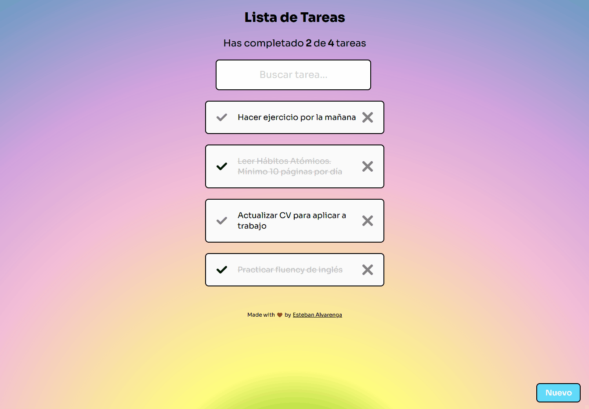

# TODO list / Lista de Tareas con React.js

¡Hola! Este es el repositorio de TODO List App. Este proyecto fue creado con la guia principal y desarrollo del [Curso de Introducción a React.js](https://platzi.com/reactjs) de Platzi.
La rama principal contiene el código con el que empezamos el curso y debido a que es un proyecto personal únicamente decidí utilizar la rama main, pero también esta la rama gh-pages, para el deploy de la aplicación.

[<code></code>](https://alvarenga144.github.io/TodoList-Reactjs18/)

La aplicación está hecha en su totalidad con React.js, inicializada usando [Create React App](https://github.com/facebook/create-react-app).
La app simula un CRUD utilizando LocalStorage del navegador, en lugar de una base de datos. Mantiene una buena persistencia de datos, mientras no se limpie los datos del navegador. Los estilos son totalmente creados y de mi invención, mostrando un diseño animado, juguetón y moderno a la vez. 
Para los estilos se útilizó úniamente CSS para los componenentes, los cuales tienen la sintaxis .JSX.

Puedes probar la aplicación en linea [AQUI.](https://alvarenga144.github.io/TodoList-Reactjs18/)

## Puedes clonar este repositorio, e instalarlo local

Para empezar solo debes clonar este repositorio (`git clone`), instalar sus dependencias (`npm i`) y ejecutar la aplicación (`npm start`).

# React Documentation

## Getting Started with Create React App

This project was bootstrapped with [Create React App](https://github.com/facebook/create-react-app).

## Available Scripts

In the project directory, you can run:

### `npm start`

Runs the app in the development mode.\
Open [http://localhost:3000](http://localhost:3000) to view it in your browser.

The page will reload when you make changes.\
You may also see any lint errors in the console.

### `npm run build`

Builds the app for production to the `build` folder.\
It correctly bundles React in production mode and optimizes the build for the best performance.

The build is minified and the filenames include the hashes.\
Your app is ready to be deployed!

See the section about [deployment](https://facebook.github.io/create-react-app/docs/deployment) for more information.

### `npm run eject`

**Note: this is a one-way operation. Once you `eject`, you can't go back!**

If you aren't satisfied with the build tool and configuration choices, you can `eject` at any time. This command will remove the single build dependency from your project.

Instead, it will copy all the configuration files and the transitive dependencies (webpack, Babel, ESLint, etc) right into your project so you have full control over them. All of the commands except `eject` will still work, but they will point to the copied scripts so you can tweak them. At this point you're on your own.

You don't have to ever use `eject`. The curated feature set is suitable for small and middle deployments, and you shouldn't feel obligated to use this feature. However we understand that this tool wouldn't be useful if you couldn't customize it when you are ready for it.

## Learn More

You can learn more in the [Create React App documentation](https://facebook.github.io/create-react-app/docs/getting-started).

To learn React, check out the [React documentation](https://reactjs.org/).

### Code Splitting

This section has moved here: [https://facebook.github.io/create-react-app/docs/code-splitting](https://facebook.github.io/create-react-app/docs/code-splitting)

### Analyzing the Bundle Size

This section has moved here: [https://facebook.github.io/create-react-app/docs/analyzing-the-bundle-size](https://facebook.github.io/create-react-app/docs/analyzing-the-bundle-size)

### Making a Progressive Web App

This section has moved here: [https://facebook.github.io/create-react-app/docs/making-a-progressive-web-app](https://facebook.github.io/create-react-app/docs/making-a-progressive-web-app)

### Advanced Configuration

This section has moved here: [https://facebook.github.io/create-react-app/docs/advanced-configuration](https://facebook.github.io/create-react-app/docs/advanced-configuration)

### Deployment

This section has moved here: [https://facebook.github.io/create-react-app/docs/deployment](https://facebook.github.io/create-react-app/docs/deployment)

### `npm run build` fails to minify

This section has moved here: [https://facebook.github.io/create-react-app/docs/troubleshooting#npm-run-build-fails-to-minify](https://facebook.github.io/create-react-app/docs/troubleshooting#npm-run-build-fails-to-minify)
